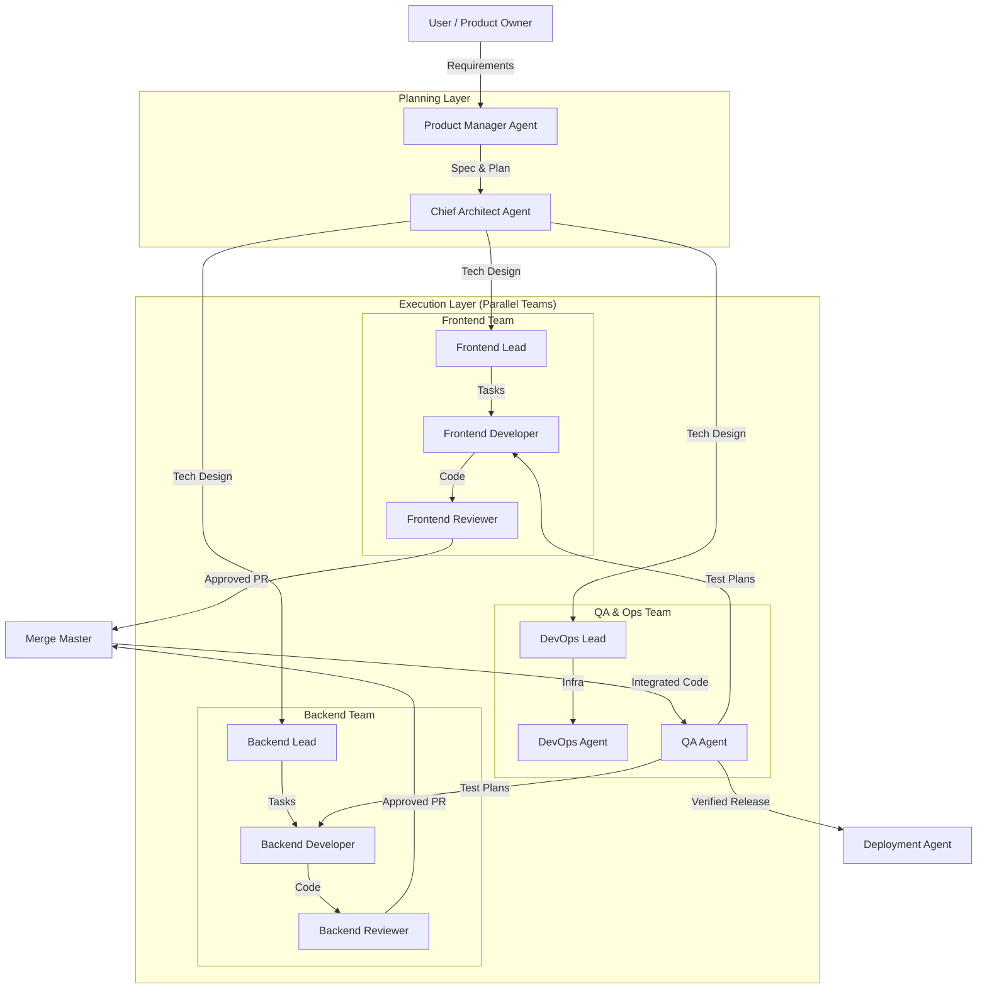

# AI Agent System for Complete Software Development

Based on "Building an AI-native engineering team" and "Mastering Multi-Agent Systems", this document outlines a comprehensive strategy for building an AI agent system capable of developing complete software.

## 1. Core Principles

To build a robust system, we must move beyond single-model reliance and adopt multi-agent principles:

*   **Specialization**: Instead of one generalist model, use specialized agents (e.g., "Frontend Expert", "Security Auditor") with distinct prompts, tools, and context.
*   **Validation (Orthogonal Checking)**: Implement "critique-revision loops" where one agent generates code and another validates it (e.g., a "Test Writer" validates a "Feature Developer").
*   **Parallelism**: Decompose large tasks into subtasks that run simultaneously (e.g., writing tests and documentation while code is being written).

## 2. Recommended Architecture: Hierarchical Hybrid

A **Hierarchical Hybrid** architecture is best suited for end-to-end software development. It mimics a human engineering organization, balancing high-level strategic direction with low-level tactical execution.

### Architecture Diagram

## 3. Agent Roles & Responsibilities

### Planning Layer
*   **Product Manager (PM) Agent**:
    *   **Goal**: Clarify requirements and scope features.
    *   **Tools**: Issue tracker (Jira/Linear), Doc writer, **Folder-Tasks (TASKS_OVERVIEW.md)**.
    *   **Output**: `PRD.md`, Feature Specifications.
*   **Chief Architect Agent**:
    *   **Goal**: Design system structure and break down work.
    *   **Tools**: File system access, Architecture diagram generator, **Folder-Tasks (Task Creation)**.
    *   **Output**: `ARCHITECTURE.md`, `PLAN.md` (Task breakdown), `task_XX.md` files.

### Execution Layer
*   **Developer Agents (Frontend/Backend)**:
    *   **Goal**: Implement features based on specs.
    *   **Tools**: IDE/Editor, Terminal, Linter, Language Server, **Folder-Tasks (Status Updates)**.
    *   **Process**: Read task -> Update Status -> Write code -> Mark [x] -> Request Review.
*   **Reviewer Agents**:
    *   **Goal**: Ensure code quality and security.
    *   **Tools**: Static analysis, Diff viewer, **Folder-Tasks (Review Status)**.
    *   **Process**: Review PR -> Comment on bugs/style -> Approve/Reject.

### Verification & Ops Layer
*   **QA Agent**:
    *   **Goal**: Verify functionality and prevent regressions.
    *   **Tools**: Test runner (Jest/Pytest), Browser automation, **Folder-Tasks (Verification)**.
    *   **Process**: Generate test cases -> Run tests -> Report failures.
*   **DevOps Agent**:
    *   **Goal**: Manage infrastructure and deployment.
    *   **Tools**: Docker, Kubernetes, CI/CD pipelines.

## 4. Workflow: From Idea to Production

> **Note**: For detailed integration with our task system, see [AI_WORKFLOW_INTEGRATION.md](docs/AI_WORKFLOW_INTEGRATION.md).

1.  **Plan**: User provides a high-level goal. PM Agent refines it into a clear spec. Architect Agent breaks it down into tasks for Frontend and Backend.
2.  **Design**: Architect Agent scaffolds the project structure or updates existing architecture docs.
3.  **Build (Iterative Loop)**:
    *   Dev Agents write code and tests.
    *   Dev Agents run local tests to self-correct.
4.  **Review**: Dev Agents submit a "Pull Request". Reviewer Agents critique it. Dev Agents fix issues until approved.
5.  **Test**: QA Agent runs integration/E2E tests on the merged code.
6.  **Deploy**: DevOps Agent deploys to staging/production and monitors logs for immediate errors.

## 5. Technology Stack & Implementation

### Frameworks
*   **LangGraph**: Recommended for stateful, complex workflows (e.g., the review loop).
*   **Agno/Mastra**: Good alternatives if performance or TypeScript-native environment is preferred.

### Context Management (MCP)
Use **Model Context Protocol (MCP)** to give agents access to:
*   **Codebase**: Read/Write files.
*   **Docs**: Knowledge base.
*   **Tools**: Git, Docker, Cloud Providers.
*   **Task System**: Read/Write `folder-tasks` markdown files.

### Getting Started Checklist
1.  **Foundation**: Build a simple "Coder + Reviewer" loop.
2.  **Infrastructure**: Add a "Planner" to break down tasks.
3.  **Scale**: Introduce specialized roles (QA, Security) and parallel execution.
4.  **Observability**: Monitor agent costs and failure rates to optimize.

## 6. Key Success Factors
*   **Human-in-the-loop**: Critical for the "Plan" and "Review" phases. Agents should propose, humans should decide.
*   **Defined Interfaces**: Clear contracts (specs, APIs) between agents to prevent "Context Confusion".
*   **Deterministic Tools**: Give agents reliable tools (linters, formatters) rather than asking them to "fix style" manually.
